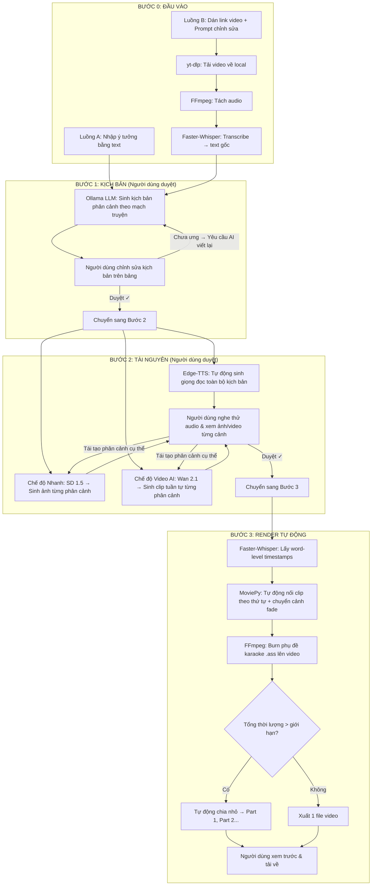
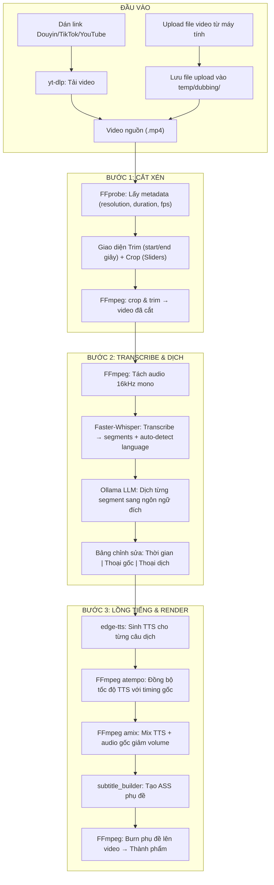

# Pipeline sản xuất video ngắn YouTube — Local AI trên RTX 3060

## Tổng quan

Hệ thống tự động hoá sản xuất video ngắn (YouTube Shorts, TikTok, Reels) chạy **hoàn toàn local** trên card **RTX 3060 12GB VRAM**, sử dụng 100% công cụ mã nguồn mở miễn phí. Giao diện web Streamlit cho phép người dùng **tương tác và duyệt từng bước** trước khi chuyển sang bước tiếp theo (human-in-the-loop).

Hỗ trợ hai luồng đầu vào:
- **Luồng A — Tạo mới**: Người dùng nhập ý tưởng → AI sinh kịch bản → sinh tài nguyên → render video.
- **Luồng B — Remake**: Người dùng dán link video → AI tải, transcribe, viết lại kịch bản theo prompt chỉnh sửa → sinh tài nguyên mới 100% → render video.

Hỗ trợ hai chế độ hình ảnh:
- **Chế độ Nhanh (Ảnh AI)**: Stable Diffusion sinh ảnh tĩnh → áp dụng hiệu ứng Ken Burns (zoom/pan) → ~2s mỗi ảnh.
- **Chế độ Video AI**: Wan 2.1 (1.3B) sinh clip video động cho từng phân cảnh → ~15-30 phút mỗi clip 5s nhưng chất lượng chuyển động thực sự.

Hỗ trợ hai hướng video:
- **Dọc (9:16)**: Tối ưu cho YouTube Shorts, TikTok, Reels — `1080×1920` hoặc `480×848`.
- **Ngang (16:9)**: Tối ưu cho YouTube thường, Facebook — `1920×1080` hoặc `848×480`.

Quy trình tự động ghép video:
- LLM tự chia kịch bản thành các **phân cảnh tuần tự** theo mạch câu chuyện.
- Hệ thống **tự động sinh clip/ảnh cho từng phân cảnh** theo thứ tự (giải phóng VRAM giữa các lần sinh).
- Độ phân giải tuỳ theo hướng video người dùng chọn: **480×848** (dọc 9:16) hoặc **848×480** (ngang 16:9).
- MoviePy **tự động nối tất cả clip** thành video liền mạch, đồng bộ với audio giọng đọc và phụ đề karaoke.
- Nếu vượt thời lượng giới hạn → **tự động cắt thành Part 1, Part 2...** tại các điểm ngắt câu tự nhiên.

---

## 1. Kiến trúc Pipeline



---

## 2. Bảng công nghệ chi tiết

| Khâu | Công nghệ | VRAM | Ghi chú |
| :--- | :--- | :---: | :--- |
| Giao diện web | **Streamlit** | 0 | Quản lý state bằng `st.session_state`, hỗ trợ hiển thị audio/video/ảnh natively |
| LLM sinh kịch bản | **Ollama** — `qwen2.5:7b-instruct` | ~5 GB | Hỗ trợ tiếng Việt tốt, tốc độ ~40 tok/s trên 3060. Ollama tự quản lý load/unload model |
| Tải video | **yt-dlp** (Python) | 0 | Hỗ trợ YouTube, TikTok, Facebook, Instagram. Gọi qua subprocess |
| Tách audio | **FFmpeg** | 0 | `ffmpeg -i input.mp4 -vn -ar 16000 -ac 1 output.wav` (16kHz mono cho Whisper) |
| Chuyển giọng nói → text | **faster-whisper** — model `small` | ~1 GB | CTranslate2, `word_timestamps=True` để lấy mốc thời gian từng từ |
| Giọng đọc TTS | **edge-tts** | 0 | Giọng Việt: `vi-VN-HoaiMyNeural` (nữ), `vi-VN-NamMinhNeural` (nam). Điều chỉnh tốc độ qua `--rate` |
| Sinh ảnh AI (Chế độ Nhanh) | **diffusers** — `Lykon/dreamshaper-8` (SD 1.5) | ~3.5 GB | Dọc: 512×768, Ngang: 768×512. ~2s mỗi ảnh. `enable_model_cpu_offload()` + `enable_vae_slicing()` |
| **Sinh video AI (Chế độ Video)** | **diffusers** — `Wan-AI/Wan2.1-T2V-1.3B-Diffusers` | **~8-10 GB** | Dọc: 480×848, Ngang: 848×480. ~5 giây/clip. `enable_model_cpu_offload()` + VAE tiling |
| Biên tập video | **MoviePy** + **FFmpeg** | 0 | Ghép clip/ảnh, chuyển cảnh fade, burn phụ đề `.ass` bằng filter FFmpeg |

---

## 3. Chi tiết chế độ sinh Video AI (Wan 2.1 — 1.3B)

### Cách hoạt động tự động
1. LLM sinh kịch bản gồm N phân cảnh, mỗi phân cảnh có `video_prompt` (tiếng Anh, được LLM tối ưu).
2. Hệ thống sinh tuần tự từng clip:
   - Load Wan 2.1 → Sinh Clip 1 → Lưu file `temp/clip_001.mp4`
   - Sinh Clip 2 → Lưu `temp/clip_002.mp4`
   - ... (không cần giải phóng VRAM giữa các clip vì dùng cùng 1 model)
   - Sau khi sinh hết → `del pipe; torch.cuda.empty_cache()` giải phóng toàn bộ.
3. MoviePy nối tất cả clip theo thứ tự, thêm chuyển cảnh fade 0.5s, đồng bộ audio.

### Code mẫu tối ưu VRAM
```python
import torch
from diffusers import WanPipeline
from diffusers.utils import export_to_video

pipe = WanPipeline.from_pretrained(
    "Wan-AI/Wan2.1-T2V-1.3B-Diffusers",
    torch_dtype=torch.float16,
)
pipe.enable_model_cpu_offload()
pipe.enable_vae_tiling()

# Sinh tuần tự từng clip cho mỗi phân cảnh
for i, scene in enumerate(scenes):
    # Tuỳ hướng video: dọc (480×848) hoặc ngang (848×480)
    h, w = (480, 848) if orientation == "vertical" else (848, 480)
    video_frames = pipe(
        prompt=scene["video_prompt"],
        num_frames=81,          # ~5 giây ở 16fps
        height=h,
        width=w,
        guidance_scale=5.0,
    ).frames[0]
    export_to_video(video_frames, f"temp/clip_{i:03d}.mp4", fps=16)

# Giải phóng VRAM sau khi sinh tất cả clip
del pipe
torch.cuda.empty_cache()
```

### Ví dụ: Video 30 giây tự động

Người dùng nhập: *"Kể câu chuyện con quạ uống nước"*

LLM tự động chia thành 6 phân cảnh liền mạch:

| Phân cảnh | Thời gian | Lời thoại | Video Prompt (AI tự sinh) |
| :---: | :---: | :--- | :--- |
| 1 | 0-5s | *"Ngày xưa có một con quạ khát nước..."* | `A thirsty black crow walking through a dry golden desert, cinematic` |
| 2 | 5-10s | *"Nó bay khắp nơi tìm kiếm nguồn nước..."* | `A crow flying over barren landscape searching for water, aerial view` |
| 3 | 10-15s | *"Cuối cùng nó phát hiện một chiếc bình..."* | `A crow landing next to a tall clay jar in a garden, close-up` |
| 4 | 15-20s | *"Nhưng mực nước quá thấp, mỏ nó không chạm tới..."* | `A crow peeking into a narrow jar, frustrated expression, detailed` |
| 5 | 20-25s | *"Nó nhìn thấy những viên sỏi bên cạnh..."* | `A crow picking up small pebbles and dropping them into a jar, smart` |
| 6 | 25-30s | *"Nước dâng lên và con quạ uống được nước!"* | `Water rising in a jar as a happy crow drinks, golden sunset lighting` |

→ Wan 2.1 sinh 6 clip × ~20 phút = **~2 tiếng** → MoviePy ghép tự động → Video 30s hoàn chỉnh!

### So sánh hai chế độ

| Tiêu chí | Chế độ Nhanh (Ảnh AI) | Chế độ Video AI |
| :--- | :--- | :--- |
| Thời gian mỗi phân cảnh | ~2 giây | ~15-30 phút |
| VRAM sử dụng | ~3.5 GB | ~8-10 GB |
| Chất lượng chuyển động | Zoom/pan giả (Ken Burns) | Chuyển động thực sự |
| Độ phân giải (Dọc) | 512×768 | 480×848 |
| Độ phân giải (Ngang) | 768×512 | 848×480 |
| Video 30s (6 phân cảnh) | **~2 phút** | **~1.5-3 tiếng** |
| Video 60s (12 phân cảnh) | **~5 phút** | **~3-6 tiếng** |
| Phù hợp cho | Sản xuất hàng ngày | Video chất lượng cao, không gấp |

> **Lưu ý**: Có thể **kết hợp cả hai chế độ** — chọn Video AI cho phân cảnh mở đầu và cao trào, Ảnh AI cho phần còn lại.

---

## 4. Thiết kế giao diện Streamlit

### 4.1 Thanh cấu hình chung (Sidebar)

| Thành phần | Loại widget | Giá trị mặc định |
| :--- | :--- | :--- |
| **Hướng video** | `st.radio` | `Dọc (9:16 — Shorts/TikTok)` / `Ngang (16:9 — YouTube)` |
| **Chế độ hình ảnh** | `st.radio` | `Nhanh (Ảnh AI)` / `Video AI (Wan 2.1)` |
| Giọng đọc | `st.selectbox` | `vi-VN-HoaiMyNeural` (Nữ) |
| Tốc độ đọc | `st.slider` | `+0%` (range: -30% → +30%) |
| Thời lượng tối đa mỗi phần (giây) | `st.number_input` | `60` |
| Model LLM (Ollama) | `st.selectbox` | `qwen2.5:7b-instruct` |
| Model sinh ảnh (nếu chế độ Nhanh) | `st.selectbox` | `Lykon/dreamshaper-8` |
| Phong cách hình ảnh mặc định | `st.text_input` | `"cinematic, detailed, 4k"` |

### 4.2 Bước 1 — Kịch bản (Script Editor)

- **Radio button**: Chọn `Tạo mới từ ý tưởng` hoặc `Remake từ link video`.
- **Luồng A** (Tạo mới):
  - `st.text_area`: Nhập ý tưởng.
  - Nút `Sinh kịch bản`.
- **Luồng B** (Remake):
  - `st.text_input`: Dán link video gốc.
  - `st.text_area`: Nhập prompt chỉ dẫn chỉnh sửa.
  - Nút `Phân tích & Remake`.
  - `st.progress`: Hiển thị tiến trình tải → tách audio → transcribe → sinh kịch bản.
- **Kết quả chung**:
  - `st.data_editor`: Bảng chỉnh sửa phân cảnh (STT | Lời thoại | Prompt hình ảnh/video).
  - Nút `Yêu cầu AI viết lại` (gửi lại Ollama).
  - Nút `✅ Duyệt kịch bản — Chuyển sang Bước 2`.

### 4.3 Bước 2 — Tài nguyên (Resource Review)

- Hiển thị từng phân cảnh theo hàng:
  - Cột trái: Lời thoại + `st.audio` (nghe thử).
  - Cột phải:
    - **Chế độ Nhanh**: Ảnh AI + Nút `🔄 Tạo lại ảnh`.
    - **Chế độ Video AI**: `st.video` (xem clip ~5s) + Nút `🔄 Tạo lại clip`.
  - `st.text_input`: Sửa prompt cho từng phân cảnh.
  - `st.checkbox`: Chọn phân cảnh dùng Video AI hay Ảnh AI (kết hợp linh hoạt).
- Nút `Tạo lại toàn bộ giọng đọc`.
- Nút `✅ Duyệt tài nguyên — Chuyển sang Bước 3`.

### 4.4 Bước 3 — Render & Xuất bản (Tự động)

- Nút `▶️ Bắt đầu Render Video`.
- `st.progress`: Tiến trình (Whisper timestamps → Ghép clip → Burn phụ đề → Chia phần → Hoàn tất).
- Nếu chia nhiều phần: danh sách `st.video` + nút tải về.
- Nếu 1 video: `st.video` xem trước + nút tải về.

---

## 5. Thuật toán chia nhỏ video tự động

Khi tổng thời lượng audio vượt quá giới hạn `max_duration`:

```
1. Chạy Whisper lấy danh sách word-level timestamps:
   words = [{word: "Xin", start: 0.0, end: 0.3}, {word: "chào", start: 0.3, end: 0.7}, ...]

2. Duyệt tuần tự các từ, tìm điểm cắt:
   - Với mỗi từ, kiểm tra xem end_time > (current_part_start + max_duration)?
   - Nếu vượt → lùi lại tìm từ gần nhất kết thúc bằng dấu câu (. ? ! ;)
   - Đánh dấu điểm cắt tại vị trí đó.

3. Chia tài nguyên theo các điểm cắt:
   - Cắt audio theo mốc thời gian.
   - Gom clip video / ảnh tương ứng với khoảng thời gian mỗi phần.
   - Cắt timestamps phụ đề (reset về 0s cho mỗi phần).

4. Render từng phần riêng biệt:
   - Gắn watermark "Phần 1/N", "Phần 2/N"... ở góc trên.
   - Xuất ra: output/video_part1.mp4, output/video_part2.mp4, ...
```

---

## 6. Quản lý VRAM RTX 3060 (12GB)

Các model AI **chạy tuần tự** (không đồng thời):

| Thời điểm | Model đang load | VRAM ước tính |
| :--- | :--- | :---: |
| Bước 1: Sinh kịch bản | Ollama (qwen2.5:7b) | ~5 GB |
| Bước 1 (Remake): Transcribe | Faster-Whisper (small) | ~1 GB |
| Bước 2 (Nhanh): Sinh ảnh | Stable Diffusion 1.5 | ~3.5 GB |
| **Bước 2 (Video AI): Sinh clip** | **Wan 2.1 (1.3B)** | **~8-10 GB** |
| Bước 3: Lấy timestamps | Faster-Whisper (small) | ~1 GB |
| Bước 3: Render video | MoviePy + FFmpeg (CPU) | 0 |

> **⚠️ Lưu ý**: Khi dùng Video AI (Wan 2.1) chiếm ~10 GB VRAM. Phải giải phóng Ollama trước khi load Wan. Hệ thống tự động xử lý tuần tự này.

Kỹ thuật đảm bảo:
- **Giải phóng VRAM thủ công** sau mỗi bước: `del model; gc.collect(); torch.cuda.empty_cache()`.
- **Ollama**: Gọi qua HTTP API (`localhost:11434`), tự quản lý load/unload sau 5 phút idle.
- **Stable Diffusion / Wan 2.1**: `pipe.enable_model_cpu_offload()` → sau khi xong → `del pipe`.
- **Faster-Whisper**: `compute_type="float16"` → sau khi xong → `del model`.

---

## 7. Cấu trúc mã nguồn

```
youtube/
├── .agent/
│   └── rules.md                    # Quy tắc phát triển dự án
├── src/
│   ├── config.py                   # Hằng số cấu hình (paths, model names, voice names)
│   ├── llm_service.py              # Gọi Ollama API: sinh kịch bản, remake kịch bản
│   ├── tts_service.py              # Gọi edge-tts: sinh file audio từ text
│   ├── image_service.py            # Load Stable Diffusion, sinh ảnh, giải phóng VRAM
│   ├── video_gen_service.py        # Load Wan 2.1, sinh clip video tuần tự, giải phóng VRAM
│   ├── whisper_service.py          # Load Faster-Whisper, transcribe, lấy word timestamps
│   ├── video_downloader.py         # Gọi yt-dlp tải video, FFmpeg tách audio
│   ├── video_compiler.py           # MoviePy: ghép clip/ảnh + audio + phụ đề, chia phần
│   ├── subtitle_builder.py         # Tạo file .ass từ word timestamps (phụ đề karaoke)
│   └── app.py                      # Giao diện Streamlit chính (quản lý state, UI 3 bước)
├── assets/
│   └── fonts/
│       └── Montserrat-Bold.ttf     # Font chữ cho phụ đề
├── temp/                           # File trung gian (audio, ảnh, video clips, downloads)
│   └── downloads/                  # Video tải về từ link
├── output/                         # Video đầu ra hoàn chỉnh
├── requirements.txt
├── run.bat                         # Script khởi chạy nhanh
└── README.md
```

---

## 8. Hướng dẫn cài đặt môi trường (Prerequisites)

### 8.1 Phần mềm bắt buộc cài trước
| Phần mềm | Mục đích | Cách cài đặt |
| :--- | :--- | :--- |
| **Python 3.10+** | Chạy toàn bộ pipeline | [python.org](https://www.python.org/downloads/) |
| **FFmpeg** | Xử lý audio/video | Tải binary về, thêm vào PATH hệ thống |
| **Ollama** | Chạy LLM local | [ollama.com](https://ollama.com/download) → `ollama pull qwen2.5:7b-instruct` |
| **CUDA Toolkit 12.x** | GPU acceleration | [nvidia.com](https://developer.nvidia.com/cuda-downloads) |

### 8.2 Thư viện Python (`requirements.txt`)
```
streamlit
requests
edge-tts
faster-whisper
diffusers
transformers
accelerate
safetensors
sentencepiece
torch --index-url https://download.pytorch.org/whl/cu121
moviepy
Pillow
yt-dlp
imageio[ffmpeg]
```

### 8.3 Tải model lần đầu
```bash
# Model LLM
ollama pull qwen2.5:7b-instruct

# Model Wan 2.1 (~5 GB, tự động tải khi chạy lần đầu)
python -c "from diffusers import WanPipeline; WanPipeline.from_pretrained('Wan-AI/Wan2.1-T2V-1.3B-Diffusers')"

# Model Stable Diffusion (~2 GB, tự động tải khi chạy lần đầu)
python -c "from diffusers import StableDiffusionPipeline; StableDiffusionPipeline.from_pretrained('Lykon/dreamshaper-8')"
```

### 8.4 Khởi chạy
```bash
pip install -r requirements.txt
ollama serve                    # Terminal 1
streamlit run src/app.py        # Terminal 2
```

---

## 9. Cảnh báo & Rủi ro

| Vấn đề | Mức độ | Giải pháp |
| :--- | :---: | :--- |
| **Edge-TTS cần Internet** | ⚠️ | Gọi API Microsoft Edge. Thay bằng Coqui TTS/VITS nếu cần offline (giọng Việt kém hơn) |
| **yt-dlp bị YouTube chặn** | ⚠️ | Cập nhật thường xuyên: `pip install --upgrade yt-dlp` |
| **Video AI rất chậm** | ⚠️ | 1 clip 5s = 15-30 phút. Video 60s = ~6 tiếng. Kết hợp với Ảnh AI để giảm thời gian |
| **VRAM không đủ khi chạy Wan 2.1** | ⚠️ | Giảm `num_frames` (49 thay vì 81) hoặc giảm resolution. Đảm bảo đã unload Ollama |
| **Whisper nhận diện sai tiếng Việt** | ⚠️ | Dùng model `small` thay vì `tiny`. Hoặc nâng lên `medium` nếu cần chính xác hơn (~2.5 GB VRAM) |

---

## 10. Kế hoạch xác thực (Verification Plan)

### Kiểm thử đơn vị

| Module | Cách kiểm thử |
| :--- | :--- |
| `llm_service.py` | Gọi Ollama, kiểm tra JSON có trường `scenes` (mỗi scene có `narration` và `video_prompt`) |
| `tts_service.py` | Sinh `.mp3` từ 1 câu tiếng Việt, kiểm tra file tồn tại |
| `image_service.py` | Sinh ảnh 512×768, kiểm tra VRAM trước/sau |
| `video_gen_service.py` | Sinh clip 480×848 (~3s), kiểm tra `.mp4` tồn tại và VRAM được giải phóng |
| `whisper_service.py` | Transcribe audio ngắn, kiểm tra danh sách words kèm timestamps |
| `video_downloader.py` | Tải video Shorts, kiểm tra `.mp4` và `.wav` tồn tại |
| `subtitle_builder.py` | Tạo `.ass` từ danh sách words giả, kiểm tra format |

### Kiểm thử tích hợp (End-to-End)

**Kịch bản 1 — Tạo mới (Ảnh AI):**
1. Nhập: *"3 sự thật kỳ lạ về lỗ đen vũ trụ"*, max `30s`, chế độ `Ảnh AI`.
2. Duyệt kịch bản → Duyệt tài nguyên → Render.
3. Kiểm tra: Video tồn tại, phụ đề karaoke khớp, tổng thời gian < 10 phút.

**Kịch bản 2 — Tạo mới (Video AI):**
1. Nhập: *"Câu chuyện cổ tích về chú thỏ dũng cảm"*, max `30s`, chế độ `Video AI`.
2. Kiểm tra: 6 clip video động, ghép mượt mà, audio đồng bộ.

**Kịch bản 3 — Remake:**
1. Dán link Shorts + prompt: *"Viết lại theo phong cách hài hước, ảnh anime"*.
2. Kiểm tra: Kịch bản mới khác video gốc, video output 100% mới.

**Kịch bản 4 — Kết hợp Ảnh + Video AI:**
1. Tạo video 60s, 2 phân cảnh dùng Video AI, còn lại dùng Ảnh AI.
2. Kiểm tra: Ghép mượt mà giữa clip động và ảnh Ken Burns.

---

## 11. Tính năng Học Tiếng Anh Self-heal (Mới)

Tính năng **Học Tiếng Anh Self-heal** là một luồng sản xuất video riêng biệt, được thiết kế để tạo ra các video học tiếng Anh tương tác hoặc thiền định với hình nền thiên nhiên thanh bình và phụ đề song ngữ thông minh.

### 11.1 Điểm đặc trưng
- **Cấu hình giọng đọc theo từng Speaker**: Trong một kịch bản, mỗi nhân vật (Speaker) có thể được cấu hình có giọng đọc TTS (Text-to-Speech) hoặc im lặng (Silent) để người xem tự đóng vai (Role-play).
- **Phụ đề Karaoke song ngữ**: 
  - Tiếng Anh hiển thị dạng Karaoke chạy từng từ. Nếu speaker có giọng đọc, karaoke chạy khớp với giọng đọc qua Whisper. Nếu speaker im lặng, karaoke chạy tự động theo tốc độ đọc thiết lập (WPM - Words Per Minute).
  - Tiếng Việt (bản dịch) hiển thị dạng chữ tĩnh, mờ hơn ở bên dưới để người dùng tham khảo, được cắt ngắn map 1:1 với dòng tiếng Anh.
- **Xử lý âm thanh thông minh**:
  - Nhạc nền chill/thiền định tự động nhỏ đi (25%) khi có speaker nói và lớn lên (60%) trong các khoảng im lặng hoặc lượt của speaker im lặng.
  - Có khoảng dừng ngắn (ví dụ: 1s) trước các phân cảnh im lặng để người dùng chuẩn bị đọc.
- **Tải nhạc nền trực tiếp**: Hỗ trợ nhập link (YouTube, SoundCloud...) và tải nhạc nền trực tiếp về thư mục lưu trữ qua UI Streamlit.

### 11.2 Các Preset cấu hình phổ biến
- **Meditation (Thiền định)**: 1 Narrator đọc chậm kèm nhạc thiền nền.
- **Silent Reading (Đọc thầm)**: Chỉ chạy chữ karaoke theo tốc độ WPM + nhạc chill (tất cả speaker tắt giọng đọc).
- **Interview Role-play**: Interviewer nói (bật TTS), Guest im lặng để người xem tự trả lời (tắt TTS).
- **Conversation (Hội thoại)**: Cả hai speaker đều bật TTS để người xem nghe hội thoại tự nhiên giữa các nhân vật.

### 11.3 Sơ đồ Timeline âm thanh & phụ đề (Ví dụ: Role-play)
```
Thời gian:  0s          3.2s    4.2s          8.8s   9.8s         13s
            ├───────────┤├──────┤├────────────┤├──────┤├───────────┤
Audio:      │ TTS ♪     ││pause ││ silence    ││pause ││ TTS ♪    │
            │Interviewer││ 1s   ││            ││ 1s   ││Interviewer│
            ├───────────┤├──────┤├────────────┤├──────┤├───────────┤
Chữ EN:     │ Hi! What's││      ││ My name is ││      ││Where are │
(karaoke)   │ your name?││      ││ Sarah. 📖  ││      ││you from? │
            │ (vàng) 🟡 ││      ││ (xanh) 🟢   ││      ││(vàng) 🟡  │
            ├───────────┤├──────┤├────────────┤├──────┤├───────────┤
Chữ VI:     │Tên bạn là ││      ││Tôi là Sarah││      ││Bạn từ đâu│
(tĩnh, mờ)  │gì?        ││      ││            ││      ││đến?      │
            ├───────────┤├──────┤├────────────┤├──────┤├───────────┤
Nhạc nền:   │  vol 25%  ││ 60%  ││   vol 60%  ││ 60%  ││ vol 25%  │
```

### 11.4 Các tính năng tối ưu hóa & UX mới cập nhật

- **Hỗ trợ 1 Video/Ảnh Nền Chung (Single Background Video/Image):**
  - Cho phép người dùng bật tùy chọn "Sử dụng 1 video/ảnh nền duy nhất" ở Sidebar.
  - Hỗ trợ chọn file nền từ thư viện, tải video từ URL bằng `yt-dlp` lưu vào thư mục `assets/backgrounds/`, hoặc **sinh video bằng AI (Wan 2.1)** / **sinh ảnh bằng AI (Stable Diffusion)**.
  - Khi chọn nguồn sinh bằng AI, hệ thống sẽ tự động gọi Wan 2.1 (đối với video) hoặc Stable Diffusion (đối với ảnh) để sinh duy nhất 1 tệp nền chung từ prompt cấu hình nền chung (lưu vào thư mục backgrounds) khi chạy sinh tài nguyên tự động, thay vì sinh nhiều tài nguyên cho từng phân cảnh.
  - Thay vì chạy GPU Stable Diffusion/Wan 2.1 sinh hình ảnh/video riêng lẻ cho từng phân cảnh, hệ thống sử dụng FFmpeg CLI để resize, crop, loop vô hạn (đối với video) hoặc lặp hình ảnh tĩnh (đối với ảnh) và mux trực tiếp với audio track đã mix. Quá trình render video thô hoàn thành trong vài giây và tiết kiệm 99% tài nguyên.
- **Sidebar cấu hình động (Dynamic Settings):**
  - Di chuyển selectbox chọn chế độ hoạt động lên đầu Sidebar.
  - Khi chọn tính năng nào, chỉ hiển thị cấu hình tương ứng của tính năng đó (ẩn/hiện thông minh). Nếu dùng video nền chung trong Self-heal, tự động ẩn cấu hình Stable Diffusion và Wan 2.1 của từng scene để giao diện tối giản nhất.
- **Góp ý kịch bản thông minh (Advanced Feedback):**
  - Tại Bước 1, thay vì chỉ có nút "Viết lại kịch bản hoàn toàn mới từ đầu", bổ sung tùy chọn "Góp ý bổ sung". AI (Ollama) sẽ phân tích kịch bản JSON hiện tại và chỉ chỉnh sửa/cập nhật phân cảnh tương ứng theo góp ý của bạn mà vẫn giữ nguyên cấu trúc cũ.
- **Hướng video & Thời lượng tối đa cho Self-heal:**
  - Hỗ trợ đầy đủ thiết lập Hướng video (Ngang/Dọc) và Thời lượng tối đa mỗi phần cho Self-heal để tự động phân tách video thành Part 1, Part 2... khi render.

---

## 12. Tính năng Dịch & Lồng tiếng Video Douyin (AI Local)

Tính năng này giúp người dùng **tải video từ link Douyin/TikTok/YouTube** hoặc **upload file video trực tiếp từ máy tính**, cho phép cắt xén thời gian (Trim) và vùng hình ảnh (Crop), tự động nhận diện ngôn ngữ gốc (bao gồm tiếng Trung), dịch lời thoại sang tiếng Anh hoặc tiếng Việt, và lồng tiếng (TTS) khớp với video gốc kèm phụ đề mới.

### 12.1 Sơ đồ kiến trúc & Luồng xử lý



### 12.2 Chi tiết thiết kế các thành phần

#### 1. UI Lồng tiếng (`app_dubbing.py`)
- **Sidebar cấu hình:**
  - Ngôn ngữ dịch đích: `["Tiếng Anh (English)", "Tiếng Việt"]`
  - Giọng đọc lồng tiếng: Lấy từ cấu hình `config.py`
  - Tốc độ đọc TTS: slider `rate` (-30% → +30%)
  - Chế độ âm thanh nền gốc: `["Giữ nhỏ (10-15%)", "Tắt hoàn toàn"]`
  - Chế độ phụ đề: `["Song ngữ gốc-dịch", "Chỉ ngôn ngữ dịch", "Không phụ đề"]`
- **Bước 1 — Tải/Upload & Cắt xén:**
  - `st.radio` chọn nguồn đầu vào.
  - Trim và Crop (sử dụng FFmpeg preview qua hình ảnh thumbnail).
- **Bước 2 — Transcribe & Dịch thuật:**
  - Sử dụng Whisper auto-detect ngôn ngữ gốc.
  - Sử dụng Ollama (Local LLM) để dịch các đoạn thoại và hiển thị qua `st.data_editor`.
- **Bước 3 — Lồng tiếng & Render:**
  - Thực hiện chạy tuần tự sinh giọng đọc, chỉnh tốc độ khớp với mốc thời gian, mix nhạc nền, tạo phụ đề và burn lên video.

#### 2. Dịch vụ lồng tiếng (`dubbing_service.py`)
- Cung cấp các pure function tương tác với FFmpeg và điều khiển luồng ghép nối:
  - `get_video_info(path)`: lấy metadata.
  - `get_video_frame(path, time_sec, output_img)`: chụp thumbnail preview.
  - `crop_and_trim_video(...)`: xử lý FFmpeg crop/trim.
  - `save_uploaded_video(...)`: lưu trữ file upload tạm thời.
  - `adjust_tts_speed(tts_path, target_duration, output_path)`: co giãn âm thanh qua `atempo`.
  - `mix_dubbed_audio(...)`: trộn âm thanh đã dịch với âm thanh nền.
  - `compile_dubbed_video(...)`: mux video + audio + burn subtitle ASS.
