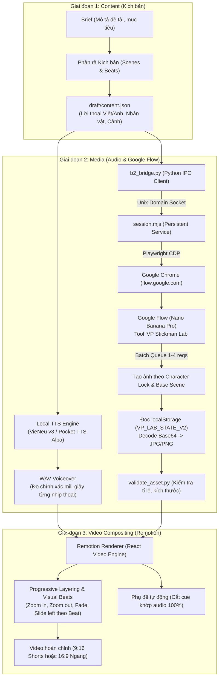
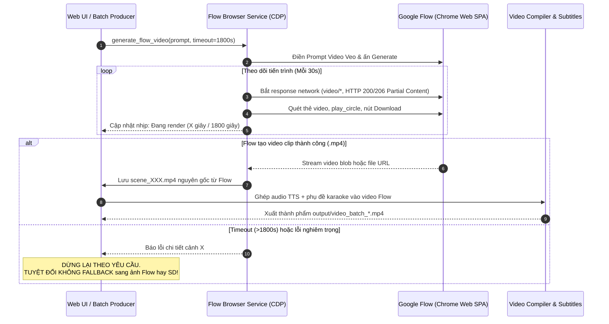

# 🎬 Báo Cáo Phân Tích & Học Hỏi: Kiến Trúc Tạo Video Bằng Google Flow (Từ Repo `tiktok-ytb`)
> **Nguồn nghiên cứu**: [hongphuoc6104/tiktok-ytb](https://github.com/hongphuoc6104/tiktok-ytb)  
> **Mục tiêu**: Nghiên cứu phương thức khai thác công cụ **Google Flow** (`flow.google.com`) để sinh ảnh và sản xuất video tự động chất lượng cao cho TikTok/YouTube Shorts.

---

## 1. Bản Đồ Tổng Quan Hệ Thống (Architecture Flowchart)



---

## 2. Điểm Cốt Lõi: Cơ Chế Điều Khiển Google Flow ("gg flow")

Trong repo `tiktok-ytb`, nhóm tác giả không dùng API thương mại tốn phí của Google Cloud mà sử dụng công cụ nội bộ **Google Flow Community Tool** (`flow.google.com`) thông qua trình duyệt người dùng đã đăng nhập:

### 2.1. Persistent Browser Session qua Chrome CDP
* **Cách vận hành**: Trình duyệt Chrome chạy với profile sẵn có (`flow_profile_directory`), mở cổng DevTools Remote Debugging (`DevToolsActivePort`).
* **Không khởi động lại Chrome mỗi lần**: Một tiến trình nền `session.mjs` chạy độc lập, duy trì kết nối CDP liên tục (`chromium.connectOverCDP`). 
* **Giao tiếp IPC**: Python (`b2_bridge.py`) gửi lệnh đến Node.js qua Unix Domain Socket (`session.sock`), đảm bảo tốc độ phản hồi tính bằng mili-giây mà không cần mở tab mới.

### 2.2. Can thiệp React Fiber Hook trong Google Flow Tool
Để nạp ảnh nhân vật gốc (Character Reference) mà giao diện web không có nút tải lên thông thường:
* Mã nguồn `browser-operations.mjs` tìm phần tử DOM `#character-selector`.
* Truy ngược cây nội bộ của React: `el.__reactFiber$...` -> tìm component cha `App` -> lấy `memoizedState`.
* **Dispatch state trực tiếp**:
  ```javascript
  // Inject Base Scene và Character Reference thẳng vào hook state của React
  h.next.queue.dispatch(base);
  h.next.next.queue.dispatch(character);
  ```
* Điền các trường biểu mẫu:
  - **Ô 0 (Prompt)**: Prompt miêu tả cảnh + Strict Character Lock (khoá chặt ngoại hình nhân vật).
  - **Ô 1 (Style)**: Phong cách minh họa nhất quán.
  - **Ô 2 & 3 (Preserve & Change)**: Kỹ thuật Image-to-Image (giữ gì, đổi gì so với ảnh cha).
  - **Ô 4 (Literal Text)**: Chữ cần sinh trên ảnh.
  - **Cấu hình Model**: `🍌 Nano Banana Pro`, chọn tỉ lệ `9:16` hoặc `16:9`, chọn số worker (`2 Workers` hoặc `4 Workers`).

### 2.3. Hàng đợi gom ảnh (Batch Queue Runner) & Ledger An Toàn
* Nhóm từ 1 đến 4 yêu cầu độc lập vào hàng đợi rồi kích hoạt nút **Start Queue**.
* Cơ chế lưu vết trạng thái theo chuẩn Transaction (`AttemptStore`):
  1. `prepared`: Khởi tạo yêu cầu.
  2. `submitting`: Ghi log trước khi bấm nút sinh ảnh (nếu crash giữa chừng sẽ đánh dấu cần đối chiếu, không bao giờ tự ý resubmit trùng lặp tốn hạn mức).
  3. `generated`: Thu hoạch ảnh khi hoàn tất.
  4. `collected`: Đọc chuỗi Base64 từ `localStorage` (`VP_LAB_STATE_V2`), giải mã và ghi ra đĩa.

---

## 3. Triết Lý Diễn Hoạt: Progressive Layering & Visual Beats

Thay vì sinh toàn bộ chuyển động bằng Video AI phức tạp (vốn tốn VRAM, hình ảnh dễ bị biến dạng/méo mó):
1. **AI Reference Generation**: Dùng Google Flow sinh ảnh gốc (Base Image) chất lượng cực cao, sắc nét, đúng tư thế và biểu cảm.
2. **Audio-driven Layering**: Âm thanh giọng đọc được sinh trước (TTS đo chính xác từng mili-giây từng từ).
3. **Video Compositing (Remotion)**:
   - Cảnh và nhân vật giữ tính liên tục (Stasis & Continuity).
   - Từng nhịp âm thanh (Beat) kích hoạt hiệu ứng camera (Pan, Zoom-in 8%, Zoom-out, Slide) hoặc xuất hiện lớp đồ họa bổ trợ (icon, text keyword).
   - Tiết kiệm 95% thời gian render và 100% tài nguyên VRAM so với việc render video qua mô hình AI diffusion.

---

## 4. So Sánh Với Hệ Thống Hiện Tại (`youtube`)

| Tiêu chí | Hệ thống hiện tại (`youtube`) | Học hỏi từ `tiktok-ytb` (Google Flow) |
|---|---|---|
| **Sinh hình ảnh** | Dùng Stable Diffusion 1.5 cục bộ (`image_service.py`), tốn VRAM GPU, ảnh dễ vỡ nét | Dùng Google Flow (`flow.google.com`), ảnh cực đẹp (Nano Banana Pro), **0% tốn VRAM GPU** |
| **Sinh chuyển động** | Dùng Wan 2.1 video diffusion (`video_gen_service.py`), chiếm 5-8GB VRAM, rất chậm | Dùng Remotion compositing theo nhịp Beat âm thanh, render cực nhanh bằng Node.js/Canvas |
| **Độ đồng nhất nhân vật** | Khó kiểm soát hạt nhiễu (seed) giữa các cảnh | Dùng Reference Hook (khoá nhân vật gốc + base scene) duy trì 100% nhân vật qua các cảnh |
| **Kiến trúc pipeline** | Ghép bằng MoviePy/FFmpeg cơ bản | Quy trình 3 bước nghiêm ngặt (Content -> Media -> Video) với gate kiểm duyệt và preview |

---

## 5. Đề Xuất Lộ Trình Áp Dụng Cho Dự Án

1. **Bước 1: Tích hợp Module Flow Browser Bridge**:
   - Xây dựng module điều khiển trình duyệt kết nối với Google Flow thông qua CDP (tận dụng nền tảng `nodriver` hoặc `playwright` sẵn có trong dự án).
2. **Bước 2: Xây dựng Prompt Engine với Character Lock**:
   - Áp dụng cấu trúc Prompt phân cấp: `Scene Topic + Base Style + Character Lock Guidance + Preserve/Change Rules`.
3. **Bước 3: Nâng cấp Video Compiler với Visual Beats**:
   - Cải tiến `src/video_compiler.py` để hỗ trợ hiệu ứng chuyển cảnh vi mô (micro-animation: Zoom, Pan, Keyframe) khớp chính xác với timestamp của Whisper/TTS.

---

## 6. Cơ Chế Chờ Video Trực Tiếp & Triệt Tiêu Fallback (Direct Video Waiting Engine)



### Các nguyên tắc cốt lõi:
1. **Kiên trì chờ kết quả (1800s / 30 phút)**: Google Veo / Flow có thể xếp hàng vào giờ cao điểm, hệ thống duy trì lắng nghe socket CDP và cập nhật tiến trình liên tục thay vì hủy sớm ở 360s.
2. **Bắt luồng stream đa định dạng**: Chấp nhận HTTP 206 Partial Content cho streaming HTML5 và mọi Content-Type chứa `video/`.
3. **Triệt tiêu Fallback ngoài ý muốn**: Khi người dùng chọn chế độ Video Flow (`flow_video`), hệ thống không bao giờ tự ý hạ cấp về ảnh tĩnh hay nạp Stable Diffusion 1.5 nặng máy.
